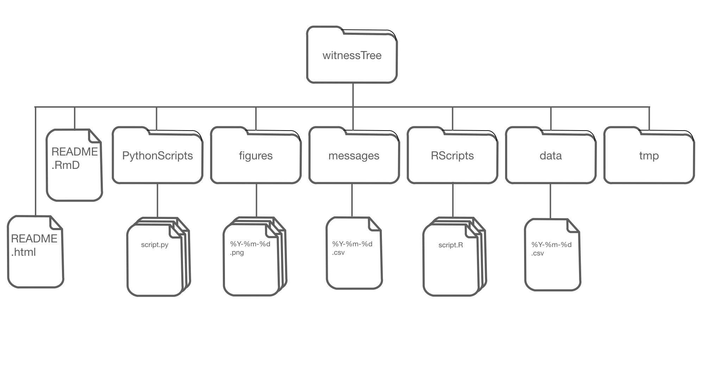

```{r setup, include=FALSE}
knitr::opts_chunk$set(echo = TRUE)
source ('RScripts/treeStats.R')
```

# What is a witness tree?

Any tree can be a witness tree by simply being enabled to witnesses life as a tree and its environment. To do this, a tree is enabled to speak for itself, using sensors and software that automatically translate data into easily interpretable messages for the general public in near-real-time.

# What is the witnessTree project?

The witnessTree project is an open-source project that strive to provide the code and documentation to fit a simple monitoring system to any tree to become a witness tree. The original witness tree is based at Harvard Forest and its development was led by Tim Rademacher. Currently, the implementation focusses on twitter and facebook as distribution platforms of the messages, but expansion to other media such as instagram, and snap chat will be explored. 

# Why make a tree talk?

Trees are the dominant form of life on earth and we want to give them a voice. We want to enable humans to understand the life experiences of trees first hand and how trees witness changes in their environment over their long lifetimes, that can stretch over several centuries. The original witness tree at Harvard Forest will additionally highlight some of the ongoing research on and around the tree with the aim to reach a larger audience. Overall, the witness tree project attempts to inform and educate an interested public about the visible and invisible happenings in the forests around us.

# How does the tree talk?

The project is divided into several hardware and software components that are undergoing active development and have been customised to a certain degree. Overall, necessities for a witness tree are, at least, one sensor, which transfer acquired data to a server that hosts the R and python scripts contained in <a href="https://github.com/TTRademacher/witnessTree">this github repository</a>.

The repository and code are freely available under the GNU Affero General Public License v3.0 (LICENSE in the repository) and is organised following a specific directory structure. There is a data/ folder containing the raw data. R scripts are stored in the RScripts/ folder. These scripts analyse the data and create messages and figures. The R scripts are divided into various functions that can be linked in the main script called witnessTree.R. The R functions also generate figures and store them as png-files in the figures/ folder. Additionally, stock photos from the images/ folder can also be used with messages. Once all the functions have been run and messages have been generated, one message is selected depending on determined priority. 

# witnessTree directory structure


In a second step, the selected message with accompanying figures and images is passed to twitter by python scripts, which themselves are stored in the pythonScripts/ folder. The python and R scripts are run every hour using a task scheduler, such as CRON on Unix-like operating systems, to generate, select and potentially post messages. 

The messages/ folder also contains a logfile (in csv format) with all posted messages and an oldMessages file, which contains messages that were generate during previous iterations, but were not selected for posting. Every iteration the priority of each message is updated, and their expire date is checked.

The config.example provides an example for how to connect to a twitter account. A copy of this file with updated account information needs to be saved as config.file in the working directory for the witness tree to work. 

Finally, a tmp/ folder exists for temporary storage of file, results, logs, etc.

# About the privacy policy

We do not collect your data, but for a full version of the privacy policy go to `r treePrivacyPolicy`. 

# Who is the team behind the witnessTree?

Tim Rademacher is the project lead. David Basler has contributed to the project with ideas and code. Clarisse Hart and Hannah Robbins have assisted in formulating a messages and working with social media. Shawna Greyeyes and Kyle Wyche contributed as part of the Harvard Forest Summer Program for Research Experience for undergraduates. Both helped formulate messages and contributed conceptual ideas. Tim developed the idea based on the <a href = "https://twitter.com/treewatchnet?lang=en">network of twittering trees from Europe</a> and the book "Witness Tree: Seasons of Change with a Century-Old Oak" by Lynda V. Mapes.
